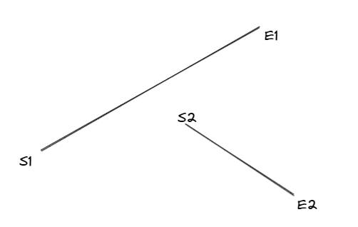

> 如何判断两条线段是否相交？

## [函数方程解法](./solution1.ts)

这种方式就是学校时学到的常规解法，判断两条线段的方程在某个区间内是否有解。

假设两条线断的方程为：
```math
f(x) = a1x + b1  (x1 < x < x2)
f(x) = a2x + b2  (x3 < x < x4)
```

我们需要判断在区间 `[x1, x2]` 中，有没有一个 x 使得 `a1x + b1 = a2x + b2`。

## [更好的解法](./solution2.ts)

1、判断线段 x 和 y 区间是否有交集

2、判断两条线段是否平行

通过两条线断的向量判断

3、线段平行

判断两条线段是否共线

4、线段不平行


两条线段相交，`S1 E1 S2` 和 `S1 E1 E2` 的旋转方向是反向的，并且 `S2 E2 S1` 和 `S2 E2 E1` 的旋转方向也是反向。



两线不相交，`S1 E1 S2` 和 `S1 E1 E2` 都是顺时针方向。

判断旋转方向，可以使用向量的叉积。
